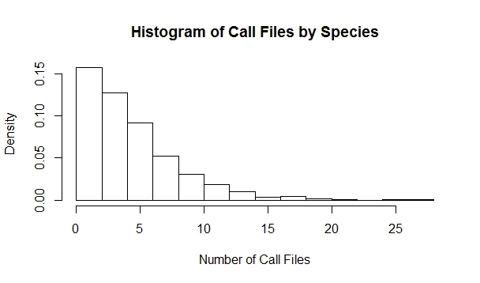

# Project Update

The original proposed time line was as follows:

\textbf{October 24 - 28}
\begin{itemize}
\item Install all necessary programs and packages
\item Get Python running
\item Choose a data subset of the 999 species from BirdCLEF 
\end{itemize}

\noindent \textbf{October 31 - November 4}
\begin{itemize}
\item Extract MFCC's from the chosen data subset
\item Implement K-means, with varying K
\item Compare results with truth
\item Write-up results
\end{itemize}

For the week of October 24 - 28, the necessary programs and packages were downloaded. The `pyAudioAnalysis` package was installed and test code was implemented, to verify that the project was feasible, using the proposed approach. Due to the amount of time necessary to install and implement the test code, a subset of the data was not chosen. 

For the week of October 31 - November 4, the bird call metadata was extracted from the `xml` files, along with the call lengths from the `wav` file headers. These were then combined into a csv, which was read into `R` for data subsetting. Using `dplyr` in `R`, the call file csv was cleaned and filtered using the following process:
\begin{itemize}
\item file lengths were limited to 15 - 45 seconds in length
\item only files with a content description containing "call" were retained  
\item eliminated genus, species levels with less than 10 call files
\end{itemize}

The files with content descriptions containing "call" were retained, due to the smaller variance in length of the files, as compared to files with descriptions containing "song". The length of calls was limited to 15 - 45 seconds, as we intend to obtain centroids from each of the files as a summary measure of the file. The length of the files in these data ranged from 0.3 seconds to 45 minutes, and thus without this length limitation the centroids would not represent comparable groups of observations.  
The histogram below displays the number of call files per genus, species combination. The approximate third quartile of the number of files is 10, a natural cut point, as to obtain a sufficient number of observations per cluster.  

\pagebreak

With the chosen subset of call files, the extraction of the MFCC's will come shortly. The calculation of the centeroids and implementation of k-means will be done in the coming week, pending Trump doesn't win. Once the centeroids are calculated, the implementation of other clustering algorithms will be fairly straightforward.  